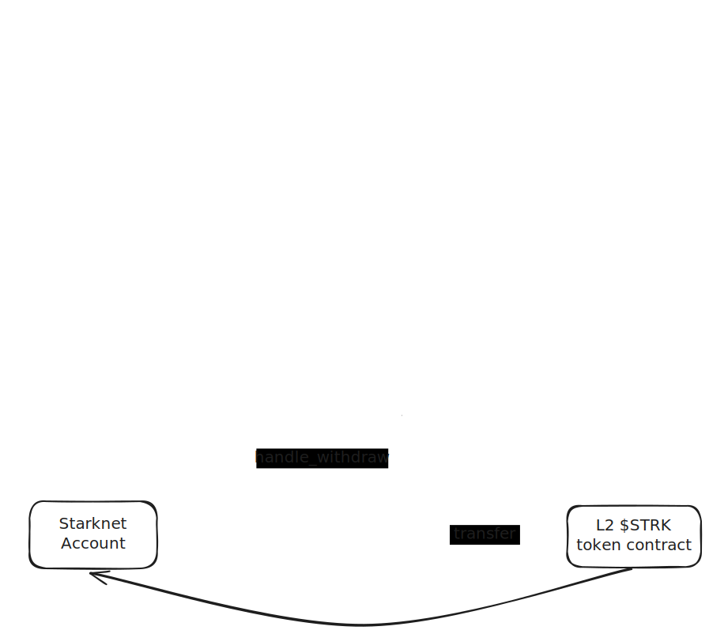

# StarkNet <-> Ethereum Bridge for Local Development

This repository implements a StarkNet-to-Ethereum bridge specifically designed for local development. It facilitates the
transfer of ERC20 tokens between the StarkNet L2 and Ethereum L1 environments.

The bridge allows a native StarkNet token ($STRK) to be bridged from StarkNet, creating a wrapped representation ($aSTRK)
 on Ethereum. This enables $STRK tokens to be used across Ethereum's ecosystem, unlocking additional use cases and
utility.

Our goal with this repository is to provide a comprehensive, step-by-step tutorial that guides developers through the
complete implementation of a StarkNet-to-Ethereum bridge. Unlike many existing resources that focus on production-level
code, this repository emphasizes foundational guidance and detailed explanations. It aims to help new developers
understand and execute cross-layer messaging while focusing on the fundamentals of L2-to-L1 communication.

We chose a bridge model that mints a representation of the StarkNet token on Ethereum, allowing developers to explore
StarkNet's unique features while leveraging Ethereum’s broad capabilities. This guide is intended as a starting point,
highlighting initial steps toward building a production bridge by covering core concepts, environment setup, and
essential cross-chain messaging. It also allows custom implementations of $STRK on Ethereum for potential use cases like
vaults or other DeFi applications, inspiring further development toward production-ready solutions.

Although not intended as a production-level implementation, this repository provides the groundwork that developers can
build upon, with flexibility to integrate unique features as they progress. By bridging $STRK tokens to access
Ethereum-based applications, new interactions can be created, driving activity on the StarkNet network.

This tutorial and implementation have been inspired by
the [Starknet Messaging Dev Repository](https://github.com/glihm/starknet-messaging-dev) and aim to contribute to the
StarkNet ecosystem by providing a structured, accessible guide emphasizing transparency, usability, and practical
understanding. For additional details, troubleshooting, and FAQs, please refer to the Q&A file included in this
repository.

### L2 -> L1 Bridging

To bridge tokens from StarkNet (L2) to Ethereum (L1), the bridge must be authorized to transfer a specified amount of
tokens from the balance by calling the `approve` function on the L2 Token contract. Once authorized, the transfer is
initiated by invoking the `deposit` function on the L2 Bridge contract, which locks the $STRK tokens on StarkNet and
sends a message to the Ethereum network.

The message has been recorded on the Starknet Core Contract. Once the transaction is processed and settled on L1, 
the $aSTRK tokens can be claimed by calling the `withdraw` function on the L1 Bridge contract. The same values supplied 
to the `deposit` function on L2 must be used when calling `withdraw`; otherwise, the L1 transaction will fail.


### L1 -> L2 Bridging

When bridging tokens back from Ethereum (L1) to StarkNet (L2), the process starts by calling the `initiate_withdraw`
function. This function burns the $aSTRK tokens on Ethereum and sends a corresponding message to the StarkNet network. 
The message is relayed through the StarkNet sequencer and processed by the L2 Bridge contract. Once the message is 
received on StarkNet, the L2 Bridge releases the equivalent amount of $STRK tokens from the locked tokens and transfers 
them to the StarkNet account, completing the bridge process.



## Table of Contents

- [1. Requirements](#1-requirements)
- [2. Setup Ethereum Contracts](#2-setup-ethereum-contracts)
- [3. Setup Starknet Contracts](#3-setup-starknet-contracts)
- [4. Bridge Tokens](#4-bridge-tokens)
  - [4.1 L2 -> L1 Bridge](#41-l2--l1-bridge)
  - [4.2 L1 -> L2 Bridge](#42-l1--l2-bridge)
- [5. Limitations](#5-limitations)

## 1. Requirements

Before starting, the following must be installed:

- [scarb](https://docs.swmansion.com/scarb/) to build Cairo contracts.
- [starkli](https://github.com/xJonathanLEI/starkli) to interact with Katana.
- [katana](https://www.dojoengine.org/) to install Katana, part of Dojo.
- [foundry](https://book.getfoundry.sh/getting-started/installation) to interact with Anvil.

For first-time cloning of the repository, install Forge dependencies as follows:

```bash
cd solidity
forge install
forge install OpenZeppelin/openzeppelin-contracts --no-commit
```

## 2. Setup Ethereum Contracts

To set up the Ethereum component for local testing, follow these steps:

1. Start Anvil in a new terminal:
   ```bash
   anvil
   ```

2. In another terminal, navigate to the Solidity directory:
   ```bash
   cd solidity
   ```

3. Copy the `anvil.env` file to `.env`, load environment variables, and build the contracts:
   ```bash
   cp anvil.env .env
   source .env
   forge build
   ```

4. Deploy the `StarknetMessagingLocal` contract:
   ```bash
   forge script script/Setup.s.sol:LocalSetup --broadcast --rpc-url ${ETH_RPC_URL}
   ```

5. Deploy the `BridgedERC20` token contract:
   ```bash
   forge create --rpc-url ${ETH_RPC_URL} --private-key <ACCOUNT_PRIVATE_KEY> src/BridgedERC20.sol:BridgedERC20 --constructor-args <ACCOUNT_ADDRESS>
   ```

6. Update the `L1_TOKEN_ADDRESS` in the `anvil.env` file with the deployed token contract address:
   ```bash
   L1_TOKEN_ADDRESS=<Deployed Token Contract Address>
   ```

7. Deploy the `L1Bridge` contract:
   ```bash
   forge create --rpc-url ${ETH_RPC_URL} --private-key <ACCOUNT_PRIVATE_KEY> src/L1Bridge.sol:L1Bridge --constructor-args <SN_MESSAGING_ADDRESS> <L1_TOKEN_ADDRESS>
   ```

8. Update the `L1_BRIDGE_ADDRESS` in the `anvil.env` file with the deployed bridge contract address:
   ```bash
   L1_BRIDGE_ADDRESS=<Deployed Bridge Contract Address>
   ```

9. Transfer ownership of the token to the bridge contract:
   ```bash
   cast send <L1_TOKEN_ADDRESS> "transferOwnership(address)" <L1_BRIDGE_ADDRESS> --rpc-url ${ETH_RPC_URL} --private-key <ACCOUNT_PRIVATE_KEY>
   ```

## 3. Setup Starknet Contracts

To set up the StarkNet contracts, follow these steps:

1. Update Katana to version 1.0.0-alpha.0:
   ```bash
   starkliup
   dojoup -v 1.0.0-alpha.0
   ```

2. Start Katana in a new terminal:
   ```bash
   katana --messaging anvil.messaging.json
   ```

3. In another terminal, navigate to the Cairo folder and build the Cairo contracts:
   ```bash
   cd cairo
   source katana.env
   scarb build
   ```

4. Declare and deploy the main token on L2:
   ```bash
   starkli declare ./target/dev/bridge_tutor_strk_token.contract_class.json --compiler-version 2.8.2 --keystore-password ""
   starkli deploy <CLASS_HASH> 0x537461726b6e6574546f6b656e 0x5354524b 18 --salt 0x1234 --keystore-password ""
   ```

5. Update the `L2_TOKEN_ADDRESS` in the `anvil.env` file with the deployed L2 token contract address:
   ```bash
   L2_TOKEN_ADDRESS=<Deployed L2 Token>
   ```

6. Declare and deploy the `l2bridge` contract:
   ```bash
   starkli declare ./target/dev/bridge_tutor_l2bridge.contract_class.json --compiler-version 2.8.2 --keystore-password ""
   starkli deploy <CLASS_HASH> <L1_BRIDGE_ADDRESS> <L2_TOKEN_ADDRESS> --salt 0x1234 --keystore-password ""
   ```

7. Update the `L2_BRIDGE_ADDRESS` in the `anvil.env` file with the deployed L2 bridge contract address:
   ```bash
   L2_BRIDGE_ADDRESS=<Deployed L2 Bridge>
   ```

8. Mint tokens on L2 for testing:
   ```bash
   starkli invoke <L2_TOKEN_ADDRESS> mint <L2_ACCOUNT> u256:200 --keystore-password ""
   ```

## 4. Bridge Tokens

When sending a message from StarkNet (L2) to Ethereum (L1), the process is slightly different from L1 to L2 messaging.
Sending messages from Ethereum to StarkNet (L1 → L2) is handled automatically by the StarkNet sequencer. However,
sending messages from StarkNet to Ethereum (L2 → L1) requires manually consuming the message on L1.

For more details, refer to
the [StarkNet messaging documentation](https://docs.starknet.io/architecture-and-concepts/network-architecture/messaging-mechanism/).

### 4.1 L2 -> L1 Bridge

1. Approve the L2 bridge to transfer tokens:
   ```bash
   starkli invoke <L2_TOKEN_ADDRESS> approve <L2_BRIDGE_ADDRESS> u256:5 --keystore-password ""
   ```

2. Initiate the token bridge by invoking the `deposit` function on the L2 bridge contract:
   ```bash
   starkli invoke <L2_BRIDGE_ADDRESS> deposit <ACCOUNT_FELT> 5 --keystore-password ""
   ```

3. Verify token balances on L2:
   ```bash
   starkli call <L2_TOKEN_ADDRESS> balance_of <L2_ACCOUNT>
   starkli call <L2_TOKEN_ADDRESS> balance_of <L2_BRIDGE_ADDRESS>
   ```

4. Update the environment variables in `anvil.env` and reload them:
   ```bash
   cp anvil.env .env
   source .env
   ```

5. Consume the message on L1 to finalize the token transfer:
   ```bash
   forge script script/ConsumeMessage.s.sol:ConsumeMessage --broadcast -vvvv --rpc-url ${ETH_RPC_URL}
   ```

6. Verify token balances on L1:
   ```bash
   cast call <L1_TOKEN_ADDRESS> "balanceOf(address)" <ACCOUNT_ADDRESS> --rpc-url ${ETH_RPC_URL}
   ```

### 4.2 L1 -> L2 Bridge

1. Initiate the bridge from L1 to L2:
   ```bash
   forge script script/SendMessage.s.sol:BridgeTokens --broadcast -vvvv --rpc-url ${ETH_RPC_URL}
   ```

2. Verify token balance on L1:
   ```bash
   cast call <L1_TOKEN_ADDRESS> "balanceOf(address)" <ACCOUNT_ADDRESS> --rpc-url ${ETH_RPC_URL}
   ```

3. Verify token balance on L2:
   ```bash
   starkli call <L2_TOKEN_ADDRESS> balance_of <L2_ACCOUNT>
   starkli call <L2_TOKEN_ADDRESS> balance_of <L2_BRIDGE_ADDRESS>
   ```

## 5. Limitations

This repository is intended for local development only and should not be used in production environments. It operates in
conjunction with development tools like Katana and Anvil, simulating cross-chain interactions between StarkNet and
Ethereum.
